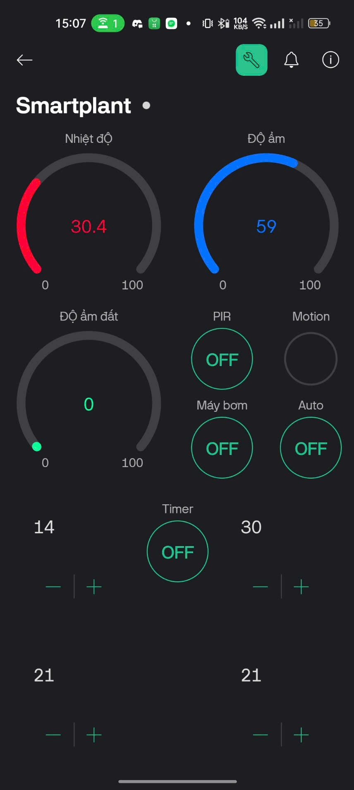
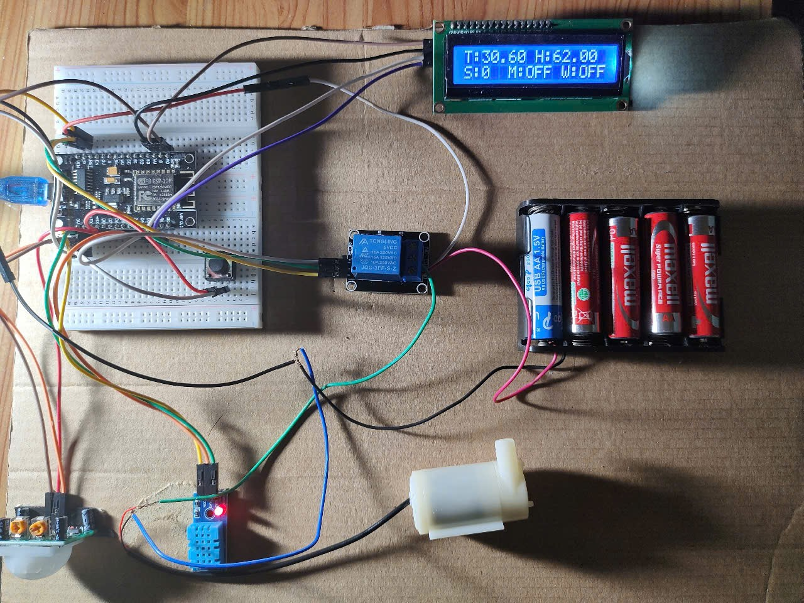

# Smart Irrigation System

A cutting-edge IoT-based smart irrigation system using ESP8266 and Blynk for remote plant watering management. This project aims to provide an efficient solution for maintaining optimal soil moisture levels and reducing water waste.

## Features

- **Remote Control:** Manage watering remotely using the Blynk app.
- **Real-Time Monitoring:** Continuously monitor soil moisture levels.
- **Automated Watering:** Automatically water plants when moisture is low.
- **Alerts & Notifications:** Receive notifications when conditions require attention.

## Prerequisites

- [Arduino IDE](https://www.arduino.cc/en/software)
- ESP8266 Board
- [Blynk Library](https://github.com/blynkkk/blynk-library)
- Wi-Fi network for connectivity

## Usage

1. **Launch the Blynk App:**  
   Open the Blynk app on your smartphone and log in.

2. **Set Up Widgets:**  
   Add and configure widgets to monitor soil moisture and control the irrigation system.

3. **Start Monitoring:**  
   Once configured, the system automatically waters your plants based on real-time data.

4. **Receive Notifications:**  
   Get alerts when watering is needed or if any issues occur.

## Demo

Below are demo images showcasing the application's interface and the product in action:

- **App Demo:**  

- **Product Demo:**  
  
